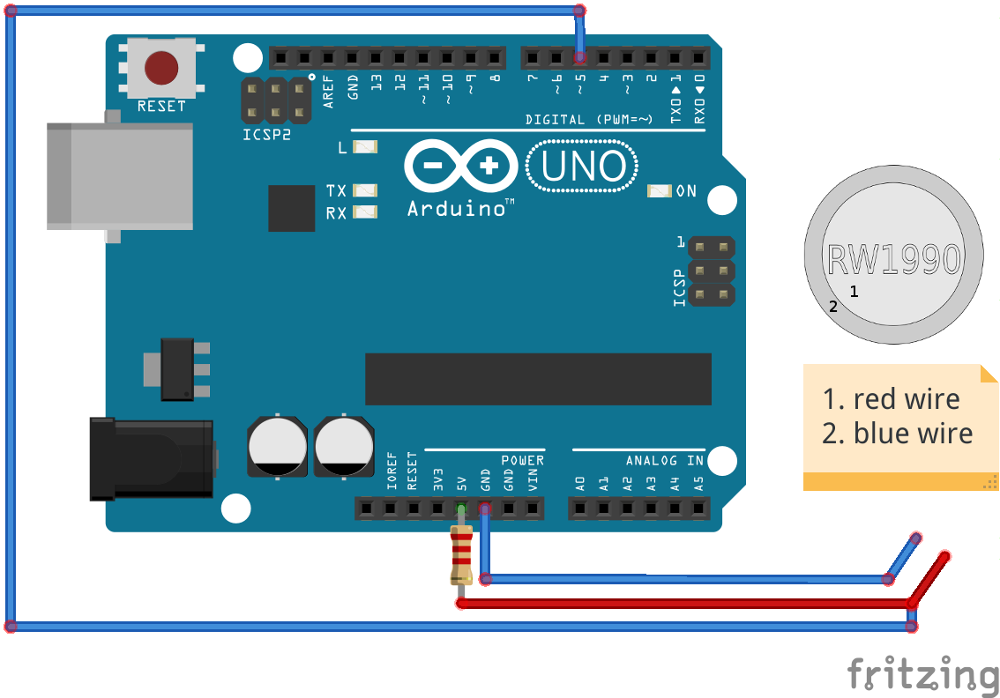

# InterKM
### Firmware for read/write rw1990 keys

I use [that boilerplate](https://github.com/bevice/avr_cmake_template) in project, this is good way to compile and upload firmware in CLion
## Install
Clone the repo via git:

```
$ git clone git@github.com:YokiToki/interkm_avr.git
```

Install dependencies:

```
$ sudo add-apt-repository ppa:ubuntuhandbook1/apps
$ sudo apt-get update
$ sudo apt-get install gcc-avr avr-libc avrdude
```

## Wiring
